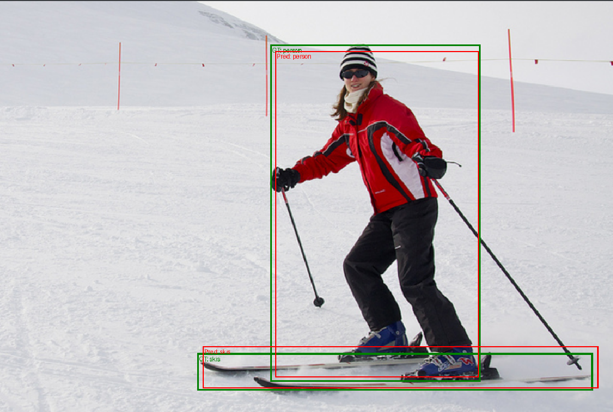

# Pix2Seq: Object Detection as a Language Modeling Task


Pix2Seq is a framework that casts object detection as a language modeling problem. Instead of standard detection heads (like classification and regression branches), Pix2Seq uses a Transformer-based decoder to generate a sequence of tokens that represent bounding boxes and class labels.

### Key Concept
The core idea is to translate an image into a sequence of "words," where each "word" corresponds to an object coordinate ($y_{min}, x_{min}, y_{max}, x_{max}$) or a class label. The model learns the syntax of this object description language.

---

## Results (Work in Progress)

Below are sample predictions from the current model checkpoint. 



> **Note:** The current model has been trained for approximately **150 epochs** (roughly 50% of the standard schedule). While it successfully detects objects, it has not yet reached the full mAP/convergence reported in the original paper (which typically requires ~300 epochs). Training is ongoing.

---

## Getting Started

### Prerequisites
* Python 3.8+
* PyTorch 1.10+
* 🤗 Transformers
* 🤗 Accelerate
* Torchvision
* COCO API (for dataset)

### Installation

1.  **Install dependencies:**
    ```bash
    pip install -r requirements.txt
    ```

2.  **Prepare the COCO Dataset:**
    * Download the COCO 2017 dataset (train and validation split).
    * Ensure your directory structure looks like this:
        ```
        /path/to/coco/
        ├── images/
        │   ├── train2017/
        │   └── val2017/
        └── annotations/
            ├── instances_train2017.json
            └── instances_val2017.json
        ```

---

## Training

This implementation uses 🤗 Accelerate for simple and efficient multi-GPU training.

### 1. Configure Accelerate (One-Time Setup)
Run this command and follow the prompts to configure your distributed training environment (e.g., number of GPUs, mixed precision).
```bash
accelerate config

accelerate launch train.py \
    --root /path/to/coco/ \
    --project_name "Pix2Seq-ResNet" \
    --batch_size 32 \
```

## Looking for Help 🤝
I am looking for compute resources to finish the full 300-epoch training run and contributors to help expand this project to Visual Genome for relationship detection. If you can help, please reach out or open a PR!